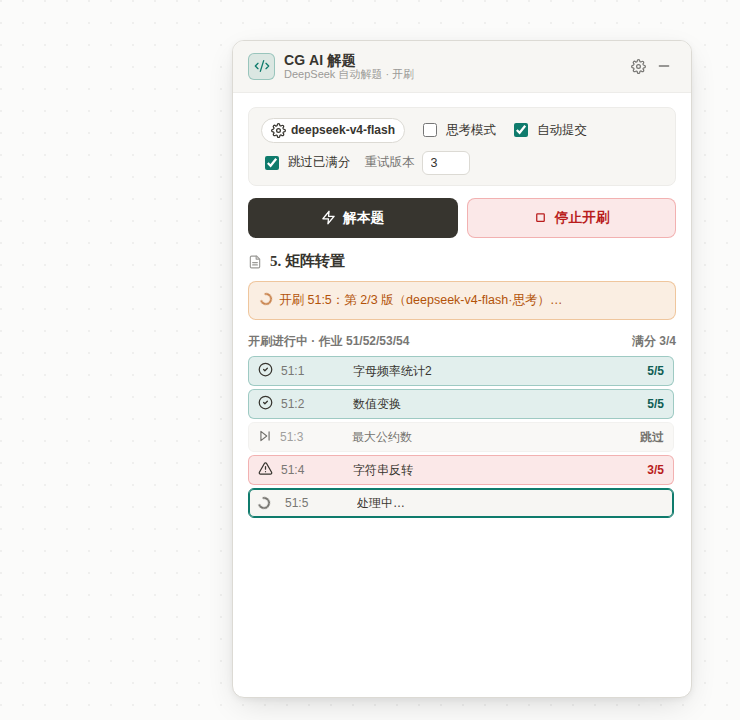

# 飞跃·解题 Solver（`feiyue-solver`）

希冀（CourseGrading / educg）编程题平台的 AI 解题脚本：
**提取完整题目 → DeepSeek 生成 → 自动提交 → 轮询并显示判题结果**，支持**一键串行开刷所有作业 / 所有题目、失败读样例多版本重试、自动跳题**。

支持三种题型：**普通编程题**（`programList`，上传 .java）、**程序填空题**（`programFillGapList`，填 `answerN` 空位）、**接口实现题**（`programWithInterfaceList`，上传含包名主类的 .java）。开刷时先读取各作业 index 页，构建**已校验且排序**的题目队列，只跳转真实存在的链接（不会再跳到空页）。

UI 参照 [Aurash](../Aurash/) 的 Notion 风格设计令牌（暖白底、近黑字、细描边、6/8/12 圆角、lucide 线性图标）。




## 安装

脚本猫 / Tampermonkey 里访问安装链接（**带 `?v=` 绕过 Cloudflare 缓存**）：

```
https://feiyue.selab.top/feiyue-solver.user.js?v=222
```

> 裸链接 `…/feiyue-solver.user.js` 会被 Cloudflare 边缘缓存（默认 4h TTL），更新后短时间内可能拿到旧版本——装新版请用带 `?v=` 的链接，或在 Cloudflare 给该路径加一条 Bypass Cache 规则。
> 首次运行脚本猫会提示「允许跨域连接」到 API 域名，**必须点允许**，否则请求会一直挂起。

## 使用

1. 打开任意编程题页（或希冀任意页）：右下角出现 **飞跃·解题 Solver** 面板。**首次无 Key 时**有蓝色**悬浮箭头**指向右上角齿轮，引导你去配置。
2. 点齿轮 / 模型按钮进入**配置页**，填 **API Base URL**（**默认 `https://api.deepseek.com`（DeepSeek 首推）**，可换 `https://aiapis.help/v1`（GPT 代理要带 `/v1`）等任意 OpenAI 兼容服务）、**API Key**（不知去哪拿？配置页给了 **GPT 系 `aiapis.help/console`** 与 **DeepSeek 系 `platform.deepseek.com`** 跳转链接），点 **刷新模型列表**（调 `<BaseURL>/models`），在**主模型 / 重试强模型下拉**里选即可，无需手敲；没有的选「其他/自定义」手填。默认主模型 `deepseek-chat`、强模型 `deepseek-reasoner`，**思考模式默认关**。
3. **解本题**：当前题一键生成并提交，显示得分。
4. **一键开刷全部**：先读作业列表建校验队列，从第一题起串行解所有作业的所有题，自动提交、自动跳下一题。可随时**停止开刷**。
   - **失败纠错**：未满分时读取判题「错误样例」（**全部失败测试点**的期望输出 vs 实际输出），**追加到同一对话**喂回模型（**不换模型**）让其据上下文纠正后重新提交。
   - **版本计划**：v1 直接解 → v2 同模型按样例纠错 → **v3 同模型「面向样例编程」**（有些题描述可能有歧义，允许按样例打表/特判通过）→ 仅当重试次数 ≥4 时，最后一版才升级到「重试强模型」。
   - **单题 ≤180s**：每题总耗时上限 180 秒，超时自动跳过下一题（进度里标「超时」）。
5. 选项：思考模式（DeepSeek `thinking` 开关，**默认关**）、自动提交、跳过已满分、失败重试次数。
6. **流式进度（v2.3）**：调用模型时状态行实时显示 **「思考中 N字 / 生成中 M字（已用时 Ns）」**——一眼分清「在思考 / 在生成 / 卡住」；>20s 无新数据才提示「⚠ 可能卡住」。彻底解决换 mimo/火山等推理模型时「整段缓冲、看着没响应」（推理模型出正文前会先思考十几秒）。
7. **日志 / 诊断（v2.3）**：右上角**齿轮旁的铃铛**——遇特殊情况（无 Key / 401 / 连不上 / 模型不支持 / 卡住 / 超时）弹**新手引导式 banner** + 操作按钮；点开是**带时间戳的历史时间线**（每步：调用/思考/生成/提交/判题/报错）；**一键复制诊断日志**（自动隐藏 API Key）+ **去提 issue**，方便定位与反馈。有未读告警时铃铛带红点。

### 兼容性（rainman 实测，v2.3）
| 服务商 | Base URL | 可用模型 |
|---|---|---|
| DeepSeek | `https://api.deepseek.com` | `deepseek-chat` / `deepseek-reasoner`（默认，发 `thinking` 参数） |
| 小米 mimo | `https://token-plan-cn.xiaomimimo.com/v1` | `mimo-v2.5-pro` 等 |
| 火山·编程计划 | `https://ark.cn-beijing.volces.com/api/coding/v3` | ✅ `kimi-k2-250711`、`deepseek-v3-250324`；❌ `deepseek-v3-1`/`deepseek-r1`/`doubao-seed-1-6`（该 endpoint 只对部分模型开放，选错会 404 `UnsupportedModel`，脚本会提示换模型） |

> 任意 OpenAI 兼容 `/chat/completions` + SSE 流式服务均可。Base URL 填到带 `/v1` 或 `/coding/v3` 的前缀，脚本自动拼 `/chat/completions` 与 `/models`。

## 文件

| 文件 | 说明 |
|---|---|
| `feiyue-solver.user.js` | **主交付物**：脚本猫 / Tampermonkey 用户脚本 |
| `harden-nginx.sh` | 部署加固：把安装链接固定从 `~/public-scripts` 提供（独立于 Aurash 构建），含 `nginx -t` + 失败回滚 |
| `preview-gen.mjs` | 抽脚本 CSS 生成预览页（纯 node） |
| `test-extract.mjs` | jsdom 离线单测（36 项：多题型提取 / 填空模板 / 失败反馈解析 / 版本计划 / 判分） |
| `test-stream.mjs` | **流式 SSE 解析单测**（vm 沙箱，无依赖，13 项：reasoning/content 分离、半行容错、CRLF、错误体、非 SSE 回退） |
| `test-boot.mjs` | **启动冒烟 + 诊断面板集成测试**（jsdom，16 项：铃铛/日志浮层/引导 banner/**复制诊断绝不含 Key**） |
| `live-stream.mjs` | 活体流式验证：用脚本真实 `parseSSE` 解真实 API 流（量「首响应/首正文/思考字数/生成字数」），凭据走 `MIMO_KEY`/`ARK_KEY` |
| `shot.mjs` | 无头浏览器视觉验证（playwright，桩页面注入脚本，截取面板/日志/思考·生成/引导 banner） |
| `gen.mjs` / `e2e.sh` | 端到端验证（jsdom 提取 + 真实 LLM + 真实提交），需 WSL fixtures，凭据走 `CG_USER`/`CG_PASS` 环境变量 |

> 仓库内不含任何账号或 API Key。

## 工作原理（已验证接口契约）

- **题目提取**：DOM `.col-10` 内、面包屑与首个 `<hr>` 之间取标题+题面；`problemID` 取自 `#showmessageFrame` 的 `src`；作业/题目列表从页面链接发现。
- **生成**：`POST <BaseURL>/chat/completions`，**`stream:true` 流式**（`max_tokens=8192`、`temperature=0`），增量 SSE 解析（`parseSSE`：分离 `reasoning_content`/`content`，尾部半行容错，`onload` 兜底，非 SSE 则按普通 JSON 回退）；DeepSeek 端点附带 `thinking:{type:enabled|disabled}`（推理模型 token 给不足会导致 `content` 为空）。流式既消除「长生成空闲挂起＝无响应」，又让 UI 实时显示思考/生成进度。
- **提交**：用 `GM_xmlhttpRequest` 直接 multipart POST 到 `showProcessMsg.jsp`（`FILE1`=源文件 + `cgSubmitBtn`/`wtime`/`javaMainCLass`）；**不走页面提交按钮**——该按钮提交后会被 `disable`，重试时会导致新代码没真正提交（"三次同一报错"的根因）。填空题改 POST `answerN` 字段；接口题用页面预填的 `javaMainCLass`、文件名取末段、且**不重定义评测已提供的接口**（否则 duplicate class）。
- **判题**：轮询 `GET longtimerunJSON.jsp?assignID&problemID`，GBK 用 `TextDecoder('gbk')` 解码。
- **开刷**：跨页状态机，进度存 `GM_setValue`，每页 `location` 跳下一题后自动续跑。队列项按 **`assignID|页型|proNum`** 唯一标识——同一作业可同时有多种题型（如 53 既有填空又有接口），`proNum` 会跨题型重复，必须含页型才不丢题/不冲突。
- **失败纠错**：失败时 POST `assignment/moretest/dynamictest.jsp` 取 `pre#wrongContent<N>`(实际)/`pre#rightContent<N>`(期望)，作为新一轮 user 消息**追加进同一对话**，同模型据上下文纠正；仅最后一版升级到强模型。判题新鲜度用「最后一次提交时间」判断（修复重复提交内容相同时的卡死）。

## 限制

- 仅适配 Java 课程（平台锁定 `progLanguage=java`）。
- 题面纯文本提取，**图片描述**的题目模型看不到。
- 生成代码强制 ASCII；需中文输出的题需手动处理。
- 浏览器必须能访问所配 API 域名；连不上/报错时铃铛「日志/诊断」会给出具体原因与引导，**复制诊断日志**（隐藏 Key）可直接提 issue。
